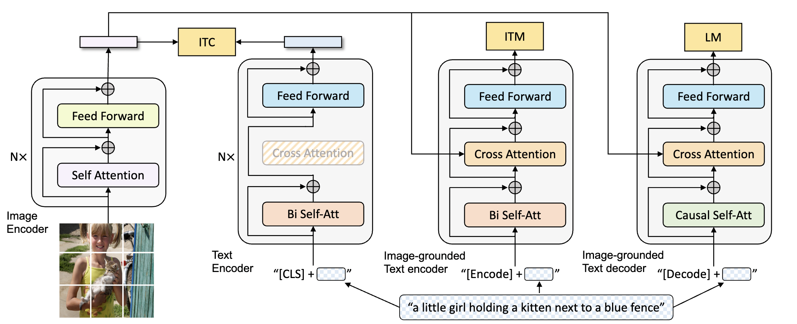
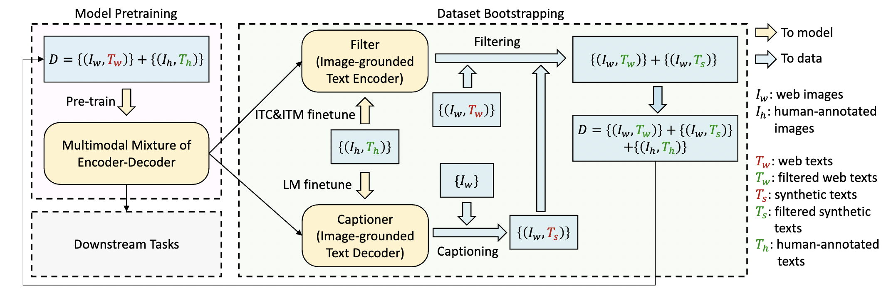
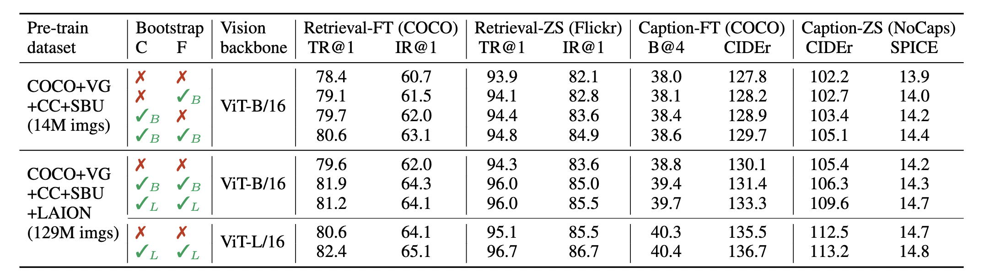

# 1. 论文标题：
**BLIP: Bootstrapping Language-Image Pre-training for Unified Vision-Language Understanding and Generation**

# 2. 论文背景与动机：
视觉-语言预训练（Vision-Language Pre-training, VLP）在提升视觉-语言任务性能方面取得了显著进展。然而，现有的预训练模型通常只能在理解型任务（如图文检索）或生成型任务（如图像描述生成）中表现出色。此外，大多数性能提升依赖于从网络中获取的噪声较多的图像-文本配对数据，这些数据并不是最佳的监督信号来源。因此，本文提出了 **BLIP**，一种全新的 VLP 框架，可以灵活地适应理解和生成任务，并有效利用网络中的噪声数据，通过引导策略提升预训练效果。

# 3. 研究目标：
BLIP 旨在设计一个可以同时处理理解和生成任务的模型，并通过引导策略（生成与过滤）优化预训练数据的质量，从而在广泛的视觉-语言任务中取得最先进的性能。

# 4. 主要贡献：
1. **多模态混合编码器-解码器（Multimodal Mixture of Encoder-Decoder, MED）**：

- 提出了一个新型模型架构，可以作为以下三种功能之一来操作：
     - **单模态编码器**：独立编码图像和文本。对图像和文本分别进行独立编码。文本编码器与 BERT（Devlin et al., 2019）相同，文本输入的开头会添加 [CLS] 标记以总结句子内容。
     - **图像为条件的文本编码器**：通过额外的交叉注意力层（Cross Attention, CA）来建模视觉-语言交互。通过在文本编码器的每个 Transformer 块中的自注意力层（Self-Attention, SA）与前馈网络（Feed Forward Network, FFN）之间插入一个交叉注意力层（Cross-Attention, CA），来注入视觉信息。文本中会加入特定任务的 [Encode] 标记，该标记的输出嵌入表示用于图像-文本对的多模态表示。
     - **图像为条件的文本解码器**：通过因果自注意力层生成基于图像的文本描述。将图像条件文本编码器中的双向自注意力层替换为因果自注意力层（Causal Self-Attention）。序列开头用 [Decode] 标记表示，序列结尾用结束标记来表示。    

2. **生成与过滤策略（Captioning and Filtering, CapFilt）**：
   - 提出了生成与过滤策略，从网络数据中生成合成文本，并去除噪声文本。
   - CapFilt 通过微调后的生成器和过滤器来处理数据，生成器根据图像生成合成文本，过滤器则根据文本与图像的匹配度来过滤掉低质量文本。
   - 最终，BLIP 使用过滤后的高质量数据进行预训练，取得了显著的性能提升。

3. **性能表现**：
   - 在多个视觉-语言任务上取得了最先进的性能，包括图文检索、图像描述生成、视觉问答（VQA）、视觉推理（NLVR2）和视觉对话（VisDial）。
   - 在零样本设置下，BLIP 在视频-语言任务中也展现了强大的泛化能力，可以直接迁移至文本-视频检索和视频问答任务中。

# 5. 详细方法：
1. **模型架构：Multimodal Mixture of Encoder-Decoder (MED)**：
   - BLIP 的模型架构采用视觉 Transformer（ViT）作为图像编码器，并采用 BERT 风格的 Transformer 作为文本编码器。
   - 该架构可以灵活地切换为单模态编码器、图像条件文本编码器或图像条件文本解码器，以便执行不同的任务。

   采用视觉 Transformer作为图像编码器，该编码器将输入图像分割为若干图像块，并将其编码为一系列嵌入表示，同时增加了一个 [CLS] 标记来表示全局图像特征。使用 ViT 更加计算友好

为了预训练一个能够同时处理理解和生成任务的统一模型，**多模态混合编码器-解码器（Multimodal Mixture of Encoder-Decoder, MED）**，这是一种可以在以下三种功能模式下运行的多任务模型：

2. **预训练目标**：
   - **图像-文本对比学习（ITC）**：对比图像和文本特征的相似度，以对齐视觉和文本的表示。
   - **图像-文本匹配（ITM）**：根据图像和文本特征的匹配程度判断是否匹配。
   - **语言建模（LM）**：在给定图像的情况下生成文本描述，优化生成文本的语言建模目标。

   1. **图像-文本对比损失（Image-Text Contrastive Loss, ITC）**：
      - 激活单模态编码器，通过鼓励正样本（匹配的图像-文本对）具有相似的表示来对齐视觉和文本的特征空间，从而与负样本区分开。这是一种有效的目标，用于提升视觉和语言的理解能力（Radford et al., 2021；Li et al., 2021a）。
       - 参考了 Li et al.（2021a）的 ITC 损失，其中引入了动量编码器（momentum encoder）来生成特征，并使用动量编码器生成的软标签作为训练目标，以应对负样本中可能包含的潜在正样本。

   2. **图像-文本匹配损失（Image-Text Matching Loss, ITM）**：
      - 激活图像条件文本编码器，学习图像-文本的多模态表示，以捕捉视觉和语言之间的细粒度对齐关系。ITM 是一个二分类任务，模型通过 ITM 头（一个线性层）来预测图像-文本对是否匹配（正样本）或不匹配（负样本）。为了找到更有信息量的负样本，采用了 Li et al.（2021a）提出的**困难负样本挖掘策略（Hard Negative Mining Strategy）**，在一个批次中具有较高对比相似度的负样本更可能被选中用于计算损失。

   3. **语言建模损失（Language Modeling Loss, LM）**：
      - 激活图像条件文本解码器，目标是生成基于图像的文本描述。该损失优化交叉熵损失，训练模型以自回归的方式最大化文本生成的概率。计算损失时，应用了 0.1 的标签平滑（Label Smoothing）。与广泛用于 VLP 的掩码语言建模（Masked Language Modeling, MLM）损失相比，LM 损失使模型能够将视觉信息转化为连贯的文本描述，并具备较强的泛化能力。

   为了在多任务学习中实现高效的预训练，文本编码器和文本解码器共享除了自注意力层（SA）之外的所有参数。原因在于编码任务和解码任务的差异主要体现在自注意力层上：
   - 编码器使用双向自注意力层来构建当前输入标记的表示。
   - 解码器使用因果自注意力层来预测下一个标记。

   另一方面，嵌入层、交叉注意力层和前馈网络在编码和解码任务中功能相似，因此共享这些层能够提高训练效率，同时从多任务学习中获益。

3. **数据引导策略（CapFilt）**：

   - 使用生成器生成合成文本，并使用过滤器过滤掉原始网络文本和合成文本中的低质量文本。
   - 最终生成的高质量数据与人工标注的数据结合，用于模型的预训练。

   由于人工标注成本过高，高质量的人工标注图像-文本对 {(Ih, Th)}（例如 COCO (Lin et al., 2014)）的数量非常有限。近期的研究（Li et al., 2021a；Wang et al., 2021）使用了从网络中自动收集的图像和替代文本对 {(Iw, Tw)}，但这些替代文本（alt-text）通常不能准确描述图像的视觉内容，使其成为噪声较大的信号，不适合用于学习视觉-语言对齐。

   **生成与过滤（Captioning and Filtering, CapFilt）**方法，以提升文本语料库的质量。图 3 展示了 CapFilt 的结构，该方法引入了两个模块：

   1. **生成器（Captioner）**：在给定网络图像的情况下，生成描述文本。
   2. **过滤器（Filter）**：用于去除噪声较多的图像-文本对。

   生成器和过滤器均由相同的预训练 MED 模型初始化，并在 COCO 数据集上分别进行微调。微调过程较为轻量化。

   具体来说：
   - **生成器**是一个图像条件文本解码器（image-grounded text decoder），通过语言建模（Language Modeling, LM）目标进行微调，在给定网络图像 Iw 的情况下生成合成的描述文本 Ts，每张图像生成一个描述文本。
   - **过滤器**是一个图像条件文本编码器（image-grounded text encoder），通过图像-文本对比（ITC）和图像-文本匹配（ITM）目标进行微调，以学习文本是否与图像匹配。过滤器能够去除原始网络文本 Tw 和合成文本 Ts 中的噪声文本，当 ITM 头（ITM head）判断某个文本与图像不匹配时，则认为该文本为噪声文本。

   最终，将过滤后的图像-文本对与人工标注的图像-文本对相结合，形成一个新的数据集，用于预训练一个新的模型。

   网络文本（Tw）与合成文本（Ts）的示例。绿色文本表示被过滤器接受的文本，而红色文本表示被过滤器拒绝的文本。

# 6. 实验结果：
BLIP 在多个视觉-语言任务上取得了最先进的性能：
- **图文检索**：在 COCO 和 Flickr30K 数据集上，BLIP 的图文检索任务平均 Recall@1 提升了 2.7%。
- **图像描述生成**：在 COCO 和 NoCaps 数据集上，CIDEr 分数提升了 2.8%。
- **视觉问答（VQA）**：VQA 分数提升了 1.6%。
- **视觉推理（NLVR2）**：在 NLVR2 数据集上展现了优异的推理能力。
- **视觉对话（VisDial）**：在 VisDial 数据集中实现了最好的性能。
- **零样本迁移至视频任务**：在文本-视频检索和视频问答任务中，BLIP 在零样本设置下的性能也显著优于现有模型。

   表 1. 评估生成器（C）和过滤器（F）在数据集引导策略中的效果。下游任务包括图文检索和图像描述生成，并分为微调（FT）和零样本（ZS）设置。

- **Pre-train dataset**：预训练数据集的类型及大小，例如：
  - **COCO+VG+CC+SBU (14M imgs)** 表示预训练数据集由 COCO、Visual Genome (VG)、Conceptual Captions (CC) 和 SBU 数据集组成，共包含 1400 万张图像。
  - **COCO+VG+CC+SBU+LAION (129M imgs)** 表示在之前的基础上增加了 LAION 数据集，共包含 1.29 亿张图像。

- **Bootstrap C / F**：表示是否使用生成器（Captioner, C）和过滤器（Filter, F）来引导数据集。
  - **✗** 表示未使用生成器或过滤器。
  - **✓B** 和 **✓L** 分别表示使用 ViT-B 和 ViT-L 作为视觉编码器的生成器或过滤器。

- **Vision backbone**：表示视觉编码器的类型：
  - **ViT-B/16** 表示使用 ViT-B 模型，并将图像分割为 16x16 的图像块。
  - **ViT-L/16** 表示使用 ViT-L 模型，并将图像分割为 16x16 的图像块。

- **Retrieval-FT (COCO)**：图文检索任务在 COCO 数据集上的微调结果。
  - **TR@1**：文本检索的 top-1 召回率（Recall@1）。
  - **IR@1**：图像检索的 top-1 召回率（Recall@1）。

- **Retrieval-ZS (Flickr)**：图文检索任务在 Flickr 数据集上的零样本评估结果。

- **Caption-FT (COCO)**：图像描述生成任务在 COCO 数据集上的微调结果。
  - **B@4**：BLEU-4 分数。
  - **CIDEr**：CIDEr 分数。

- **Caption-ZS (NoCaps)**：图像描述生成任务在 NoCaps 数据集上的零样本评估结果。
  - **CIDEr**：CIDEr 分数。
  - **SPICE**：SPICE 分数。

总结：
1. 使用生成器（C）和过滤器（F）能够显著提升模型在图文检索（COCO 和 Flickr 数据集）和图像描述生成（COCO 和 NoCaps 数据集）任务中的性能。
2. 随着数据集规模的扩大（从 14M 到 129M），模型在各项任务中的表现均有提升。
3. 使用 ViT-L/16 作为视觉编码器的模型（与 ViT-B/16 相比）在大规模数据集上的性能更好，尤其是在零样本设置下的任务表现（如 NoCaps 数据集的 CIDEr 和 SPICE 分数）。

# 7. 未来工作：
未来研究方向可以集中在以下几点：
1. 多轮次的数据引导策略，不断提升数据质量。
2. 为每个图像生成多个合成文本，以进一步扩大数据集规模。
3. 采用模型集成技术，通过多个生成器和过滤器的组合来提升模型性能。

# 8. 结论：
BLIP 提供了一个有效的视觉-语言预训练框架，通过引导策略优化数据质量，并通过多模态混合编码器-解码器架构，提升了理解和生成任务的综合性能。该方法在多个任务中取得了最新的最佳结果，并展示了其在多模态任务中的广泛适用性和强大的泛化能力。

更多详细信息及代码可以通过 [GitHub 链接](https://github.com/salesforce/BLIP) 获取。
