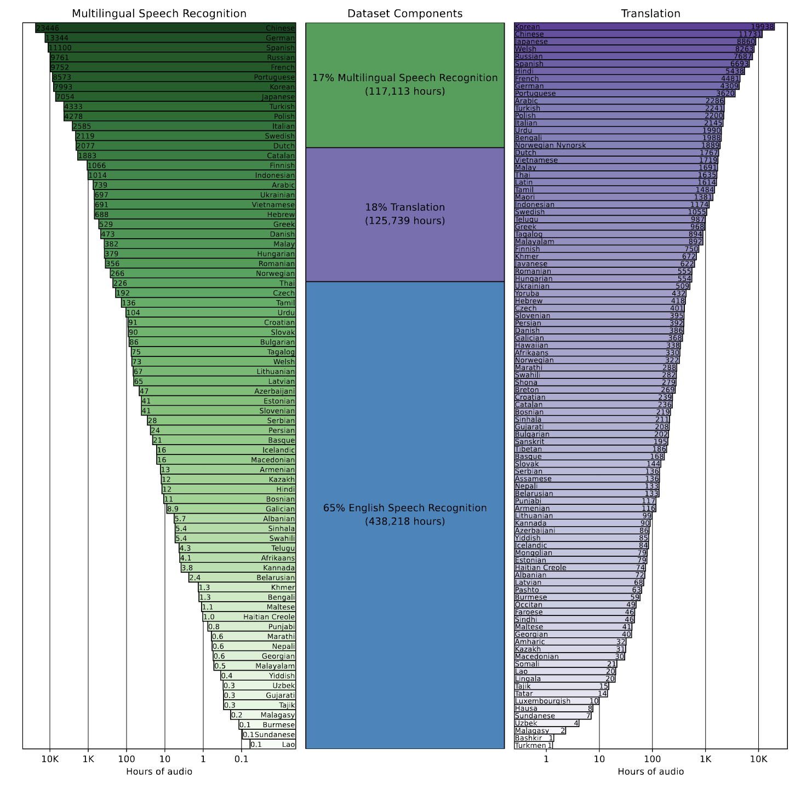
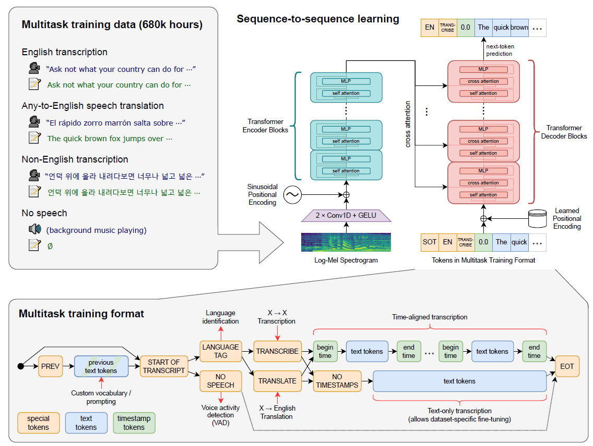
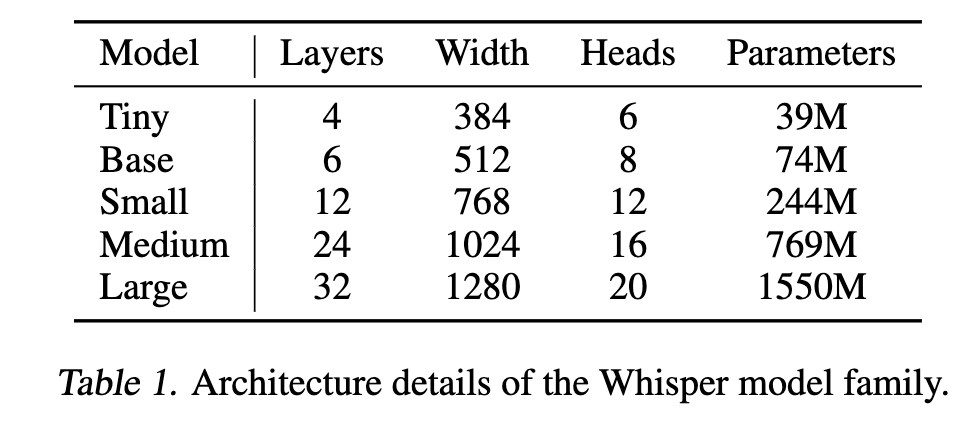

## Abstract
研究了语音处理系统的能力，这些系统仅通过预测互联网上大量音频的文本转录进行训练。当训练数据扩展到68万小时的多语言和多任务监督时，所生成的模型能够很好地泛化到标准基准上，并且通常与先前完全监督的结果具有竞争力，而在零样本迁移设置下则无需进行任何微调。与人类相比，这些模型在准确性和鲁棒性方面已接近人类水平

## Introduction
近年来，无监督预训练技术的开发极大地推动了语音识别的进步，其中的典型方法包括 Wav2Vec 2.0（Baevski et al., 2020）。由于这些方法直接从原始音频中学习，无需人工标注，它们能够高效利用大规模的未标注语音数据集，并迅速扩展至多达 100 万小时的训练数据（Zhang et al., 2021），远远超出了传统监督数据集的规模（通常约为 1000 小时）。通过在标准基准上进行微调，这种方法特别在低数据场景下改进了语音识别的技术水平。

尽管这些预训练的音频编码器能够学习高质量的语音表示，但由于它们完全是无监督的，因此缺乏等效的高质量解码器，将这些表示映射为可用的输出。这种限制意味着仍需要一个复杂的微调阶段，才能执行诸如语音识别等任务。这种微调要求不仅增加了使用难度，也增加了模型过拟合于训练数据的风险。
挑战：

	•泛化问题：机器学习方法通常在训练数据上表现出色，但可能在新数据分布上失败。例如，Radford et al.（2021）发现，将一个计算机视觉模型在 ImageNet 数据集上微调后，其对象分类准确率提高了 9.2%，但在其他七个自然图像数据集上却未观察到平均准确率的提高。这表明模型可能会利用特定数据集的特性，而这些特性对于人类来说并不明显，但对其他数据分布并不通用。

- **语音识别的关键目标**：一个理想的语音识别系统应能在广泛的环境下可靠运行，无需针对每种应用场景进行监督微调。

之前的研究表明，通过在多个数据集和领域上进行监督预训练的语音识别系统表现出更高的鲁棒性，并能够更有效地泛化（Narayanan et al., 2018；Chan et al., 2021）。然而，这种方法依赖于可用的高质量语音识别数据集，而这些数据集的规模通常较小。例如，SpeechStew（Chan et al., 2021）结合了 7 个现有数据集，总计仅 5140 小时的监督数据。

**我们的贡献：**
1. **大规模数据扩展**：为了解决数据集规模限制的问题，本研究通过使用更大规模但弱监督的数据扩展了语音识别的训练范围，从而生成了包含 68 万小时标注音频的数据集。
2. **多语言和多任务训练**：我们扩展了弱监督预训练的范围，不仅涵盖英语语音识别，还包括多语言（96 种语言）和多任务（例如翻译和语音活动检测）训练。
3. **零样本性能**：我们证明了大规模弱监督语音识别模型可以在零样本条件下转移到现有数据集，而无需特定数据集的微调来实现高质量结果。

通过这项工作，我们表明简单地扩展弱监督预训练的规模在语音识别中仍未被充分利用。我们将模型和推理代码开源，以促进鲁棒语音识别的进一步研究。

---

### **Approach **

---

#### **2.1 数据处理**

与最近利用互联网上大规模文本进行机器学习系统训练的趋势一致，我们采用了一种极简的数据预处理方法。与许多语音识别工作不同，我们训练 Whisper 模型直接预测转录的原始文本，而无需进行显著的标准化操作，依赖序列到序列模型的表达能力，将语音和转录形式进行映射。这简化了语音识别管道，因为不需要单独的逆文本标准化步骤来生成自然化的转录。

我们从互联网上音频与转录文本配对的数据中构建数据集。这导致数据集涵盖了许多不同环境、录音设置、说话者和语言的音频的广泛分布。尽管音频质量的多样性有助于训练模型的鲁棒性，但转录质量的多样性并非如此。初步检查发现，原始数据集中包含大量低质量的转录文本。为了解决这个问题，我们开发了多种自动化过滤方法来改进转录质量。

- **过滤低质量数据**:  
  - 很多互联网转录文本是现有语音识别系统生成的，训练这种混合了人类和机器生成数据的模型可能会显著降低性能。我们使用多种启发式方法检测并移除机器生成的转录文本，例如删除纯大写或小写的文本、缺乏标点符号的转录。
  - 我们还通过一个语言检测器确保音频的语言与转录文本的语言匹配，否则我们会将其移除或转为翻译数据。

- **数据分割**:  
  - 将音频文件分割成 30 秒的片段，并与相应的文本对齐。包括无语音的片段，用于训练语音活动检测。

---

#### **2.2 模型架构**

---

#### **2.4 训练细节**

- **模型规模**：训练了从 Tiny (39M 参数) 到 Large (1.55B 参数) 的多种规模模型。  
- **优化器**：使用 AdamW 和梯度裁剪，采用线性学习率衰减策略。  
- **训练策略**：训练 256 个片段的批量大小，约 2-3 个 epoch。通过多样化的数据分布确保模型的泛化能力。

---

### **2.2 Model Architecture **

---

由于本研究的重点是探索大规模监督预训练在语音识别中的能力，我们选择了一个现成的架构来避免因模型改进而混淆研究结果。我们选择了 **编码器-解码器 Transformer 架构**（参考 Vaswani et al., 2017），因为这种架构在扩展规模时已被广泛验证具有可靠性。以下是模型的具体架构细节：

---

#### **输入预处理**
1. **音频采样**：
   - 所有输入音频被重新采样为 **16,000 Hz**。
   - 音频被处理为 **80 通道的对数幅度 Mel 频谱图**，每个窗口为 25 毫秒，步长为 10 毫秒。
2. **特征归一化**：
   - 将输入特征全局缩放至 -1 和 1 之间，并确保整个预训练数据集中约为零均值。

---

#### **编码器**
1. **输入处理**：
   - 编码器处理音频的 Mel 频谱输入，首先通过一个小型前置结构（stem）。  
2. **前置结构**：
   - 包含两个卷积层，卷积核宽度为 **3**，激活函数为 **GELU**（参考 Hendrycks & Gimpel, 2016）。
   - 第二个卷积层的步幅为 **2**，以缩减输入特征的时间分辨率。
3. **位置编码**：
   - 对经过卷积的输出添加 **正弦位置嵌入**，为序列建模提供时间位置信息。
4. **Transformer 块**：
   - 编码器使用 **预激活残差块**（参考 Child et al., 2019）。
   - 在编码器输出层应用 **最终层归一化**（Layer Normalization）。

---

#### **解码器**
1. **位置嵌入**：
   - 解码器使用 **学习的嵌入** 来表示位置编码。
2. **共享词表**：
   - 解码器共享输入和输出的字节级词汇表（参考 Press & Wolf, 2017）。
3. **一致性设置**：
   - 编码器和解码器具有相同的宽度和 Transformer 块的数量。

---

#### **分词器**
1. **英文字节级 BPE 分词器**：
   - 英语模型使用与 GPT-2 相同的字节级 BPE 分词器（参考 Sennrich et al., 2015; Radford et al., 2019）。
2. **多语言模型的调整**：
   - 多语言模型重新拟合词汇表（保持词汇表大小不变），以避免其他语言过度分割，因为 GPT-2 的 BPE 词汇表专为英语设计。

---

#### **总结**
这一架构旨在通过稳定可靠的 Transformer 模型高效处理大规模数据。具体细节如图 1 所示，模型的编码器-解码器设计以通用性和可扩展性为核心，从而在多语言、多任务的预训练中展现其能力。

---

### **2.3 Multitask Format **

---

尽管预测给定音频片段中的单词是语音识别问题的核心部分，但完整的语音识别系统通常包括许多附加组件，例如语音活动检测（Voice Activity Detection, VAD）、说话人分割、以及逆文本标准化（Inverse Text Normalization, ITN）。这些组件通常单独处理，导致围绕核心语音识别模型形成一个相对复杂的系统。为了降低复杂性，我们希望使用一个单一的模型来执行整个语音处理管道，而不仅仅是核心的识别部分。

#### **多任务接口设计**
针对多任务的模型设计，我们使用了一种简单的格式，通过解码器的输入序列化地指定任务和条件信息：

1. **语言识别**：
   - 解码器首先预测正在被说的语言，并使用一个唯一的语言标签标记每种语言（数据集中共包含 99 种语言标签）。
   
2. **无语音检测**：
   - 对于没有语音的音频片段，模型被训练预测 `<|nospeech|>` 标签，以表示该片段没有语音。

3. **任务指示**：
   - 模型通过 `<|transcribe|>` 或 `<|translate|>` 标签来指定任务类型是转录还是翻译。

4. **时间戳选择**：
   - 如果需要生成时间戳，模型将生成 `<|timestamps|>` 标签，并在输出中交替预测时间戳和对应的文本。

5. **输出格式**：
   - 输出从 `<|startoftranscript|>` 标签开始，直到 `<|endoftranscript|>` 标签结束。
   - 时间戳被量化为最近的 20 毫秒，并在词语前后插入时间标记（起始和结束时间）。

---

#### **训练目标**
- 模型被训练以预测整个序列，包括所有任务和时间戳的相关标记。
- 当生成带时间戳的转录时，如果某个音频片段只部分包含最终文本段落，模型会预测该段落的开始时间标记以指示需要后续窗口进行补充解码。

此统一格式简化了多任务训练，将复杂的语音处理任务整合到一个单一模型中处理。

---

### **2.4 Training Details **

---

#### **模型规模**
为了研究 Whisper 的扩展属性，我们训练了一系列不同规模的模型，从最小的 **Tiny 模型（39M 参数）** 到最大的 **Large 模型（1.55B 参数）**。每种模型的架构细节总结如下：

- **Tiny**: 4 层 Transformer 块，宽度 384，注意力头数 6，参数量 39M。
- **Base**: 6 层 Transformer 块，宽度 512，注意力头数 8，参数量 74M。
- **Small**: 12 层 Transformer 块，宽度 768，注意力头数 12，参数量 244M。
- **Medium**: 24 层 Transformer 块，宽度 1024，注意力头数 16，参数量 769M。
- **Large**: 32 层 Transformer 块，宽度 1280，注意力头数 20，参数量 1.55B。

---

#### **优化器和梯度策略**
- **优化器**: 使用 AdamW 优化器（参考 Loshchilov & Hutter, 2017）。
- **梯度裁剪**: 应用梯度裁剪以防止梯度爆炸（参考 Pascanu et al., 2013）。
- **学习率调度**: 学习率从 0 线性上升，并在前 2048 次更新中逐渐减小到零。

---

#### **训练细节**
- **批量大小**: 每次训练使用 256 个音频片段。  
- **训练时长**: 模型被训练了 220 次更新，约相当于 2-3 次完整的数据集遍历。  
- **混合精度**: 使用 FP16 进行训练，并结合动态损失缩放和激活检查点技术以优化内存使用（参考 Griewank & Walther, 2000；Chen et al., 2016）。

---

#### **数据增强与正则化**
- 为避免过拟合，由于训练只持续了几轮 epoch，因此我们并未使用任何数据增强或正则化方法。
- 相反，依赖于大规模数据集的多样性来增强模型的泛化能力和鲁棒性。

---

#### **额外调整**
在早期开发和评估中，我们发现 Whisper 模型有时会错误地猜测说话人的名字。这是因为训练数据中许多转录包含了说话人姓名的信息，但这些信息往往无法从 30 秒的音频上下文中推断出来。为了消除这一行为，我们对一小部分未包含说话人标注的转录数据进行微调，从而有效地移除了这一倾向。

---

### **3. 实验**

---

#### **3.1 零样本评估**

Whisper 的主要目标是开发一个强大的语音处理系统，能够在不同的分布上可靠地工作，而无需针对特定数据集进行微调。为评估这一能力，研究团队使用了多个现有的语音处理数据集，在 **零样本设置** 下测试 Whisper 的性能。这意味着模型在测试时未使用这些数据集中的任何训练数据，从而能够全面衡量模型在领域、任务和语言上的泛化能力。

---

#### **3.2 评估指标**

语音识别研究通常使用 **词错误率（Word Error Rate, WER）** 作为评估指标。WER 通过计算模型输出与参考转录之间的编辑距离来衡量错误。然而，WER 会惩罚所有格式和样式上的差异，例如缩写或标点符号，这在实际中可能是无关紧要的。

为了减少这种惩罚并提供更公平的比较，研究团队开发了一种 **文本标准化工具**，在计算 WER 前对转录文本进行标准化。这种方法大幅降低了非语义性差异的影响。某些数据集上的 WER 因此减少了 **50%**，证明了标准化的重要性。

---

#### **3.3 英语语音识别**

Whisper 在广泛使用的 LibriSpeech 数据集上进行了评估，取得了 **2.5% 的 WER**，与 2019 年中期的监督模型表现相当。然而，在分布外数据集上的测试中，Whisper 显示出了显著的 **鲁棒性** 优势。

主要发现包括：
- Whisper 在多个分布外数据集上的表现优于仅在 LibriSpeech 上训练的监督模型。
- 最小的 Whisper 模型（39M 参数）虽然在 LibriSpeech 上的 WER 稍高，但在其他数据集上的性能与最佳监督模型相当。
- Whisper 在分布外数据集上的 **相对错误率（RER）** 平均减少了 **55.2%**。

这些结果表明，在评估模型能力时，应强调零样本和分布外测试，而不仅仅是分布内性能。

---

#### **3.4 多语言语音识别**

Whisper 在两个多语言基准数据集上进行了测试：**Multilingual LibriSpeech (MLS)** 和 **VoxPopuli**。

- 在 MLS 上，Whisper 的 WER 为 **7.3%**，优于 XLS-R 和 mSLAM 等现有模型。
- 在 VoxPopuli 上，Whisper 的表现不如某些监督模型，可能是因为其他模型在训练中使用了该数据集的更多分布。

多语言性能与训练数据的量强相关：
- 训练数据较多的语言（例如英语）表现出更低的 WER。
- 具有独特书写系统或语言特性的语言（例如希伯来语、泰卢固语、中文和韩语）表现较差，可能由于数据质量和分词器的匹配问题。

在 Fleurs 数据集上的测试表明，语言的训练数据量每 **增加 16 倍**，WER 大约会减半。

---

#### **3.5 翻译**

在 **CoVoST2 的 X → 英语** 子集上评估 Whisper 的翻译能力：
- Whisper 在零样本设置下实现了 **29.1 BLEU**，创下新的最优成绩。
- 对于低资源语言，Whisper 的表现特别出色，比 mSLAM 提升了 **6.7 BLEU**。
- 对于高资源语言，Whisper 的性能与现有监督模型相当。

此外，在 Fleurs 数据集上的翻译性能与训练数据的相关性较弱（R² = 0.24），表明翻译数据中的噪声可能限制了性能的提升。

---

#### **3.6 语言识别**

Whisper 在 Fleurs 数据集上的语言识别能力评估结果：
- **64.5% 的准确率**，低于监督模型的最佳表现。
- 表现差距主要是由于 Whisper 数据集中缺乏 Fleurs 数据集中的 20 种语言训练数据。

在重叠的 82 种语言中，Whisper 达到 **80.3% 的准确率**，接近理论最大值 **80.4%**。

---

#### **3.7 噪声鲁棒性**

Whisper 在添加白噪声和酒吧噪声（模拟嘈杂环境）的条件下进行了测试：
- Whisper 在低信噪比（SNR < 10 dB）下的表现优于基于 LibriSpeech 训练的 14 个模型。
- 酒吧噪声测试表明，Whisper 对自然环境噪声的鲁棒性更强。

---

#### **3.8 长音频转录**

由于 Whisper 模型只能处理 30 秒的音频片段，研究团队开发了一种 **缓冲转录策略** 来处理长音频：
- 将音频分割为连续的 30 秒窗口，并通过时间戳预测对齐上下文。
- 使用束搜索（Beam Search）和动态温度调节提高转录的可靠性。

在包括 TED-LIUM3、Kincaid46 和 CORAAL 的 7 个长音频数据集上，Whisper 的表现优于开源模型（如 NVIDIA STT）和部分商用 ASR 服务。

---

#### **3.9 与人类表现的比较**

为了评估 Whisper 的转录能力是否接近人类：
- 从 Kincaid46 数据集中选取了 25 个录音，由 Whisper 和专业转录服务进行转录。
- Whisper 的 WER 比最佳的人类转录服务高出 **1.15%**，表明其英语语音识别能力接近人类水平。

---

### **4. 分析与消融实验**

---

#### **4.1 模型扩展**

弱监督训练方法的一大优势在于其可以利用远超传统监督学习的数据集。然而，这种方法可能会带来如下问题：数据质量可能较低，导致模型性能饱和于数据集的固有质量水平，且可能远低于人类水平。此外，随着模型容量和计算量的增加，模型可能会倾向于利用数据集的特定特性，导致在分布外数据上的鲁棒性反而下降。

为验证这一点，研究团队分析了不同模型规模的 Whisper 在零样本泛化上的表现。主要结果总结如下（见图 8）：
- **模型规模的提升持续带来性能提升**：除英语语音识别外，Whisper 的多语言语音识别、语音翻译和语言识别任务的性能随着模型规模的增大而持续提升。
- **英语语音识别性能趋于饱和**：对英语语音识别任务，性能提升的边际收益明显减小，可能是因为性能接近人类水平。

---

#### **4.2 数据集扩展**

Whisper 的训练数据集规模达到 680,000 小时，是语音识别领域中规模最大的监督数据集之一。为研究数据集规模的重要性，研究团队对数据集进行了下采样（从 0.5% 到 8%），并与全数据集训练的中型模型进行比较。结果表明：
- 数据集规模的增加在所有任务中都带来了性能提升，但不同任务和规模的改进率差异显著。
- **英语语音识别**：从 3,000 小时到 13,000 小时的训练数据显著提升 WER，而 13,000 小时到 54,000 小时之间的提升减缓。在此基础上扩展到全数据集（增加 12.5 倍数据量）仅进一步降低了 1 个百分点的 WER。
- **多语言语音识别**：WER 的改进遵循幂律趋势，但在 54,000 小时之后，性能提升减缓。
- **语音翻译**：训练数据少于 7,000 小时时，性能几乎为零；在 54,000 小时之前遵循大致的对数线性改进趋势，但之后收益减小。

总体趋势表明，当训练数据达到一定规模时，模型的性能提升开始趋于平缓。然而，这种趋势可能意味着当前的 Whisper 模型相对于数据集规模仍然训练不足，进一步的性能改进可能需要更大的模型和更长的训练时间。

---

#### **4.3 多任务与多语言迁移**

将单一模型联合训练在多任务和多语言上，可能引发负迁移，即多个任务之间的干扰导致性能下降。为研究这一现象，研究团队将仅用于英语语音识别的模型与多任务、多语言训练的标准模型进行了比较，并调整了针对英语语音识别任务的训练 FLOPs。

结果显示（见图 9）：
- **小模型与中等计算量**：联合训练模型在性能上低于仅训练于英语语音识别的模型，显示了任务之间的负迁移。
- **大模型与高计算量**：联合训练模型在性能上超过了英语专属模型，表明其他任务的正迁移逐渐占据主导地位。

这表明多任务与多语言训练在大规模训练时可带来正迁移，从而提升整体性能。

---

#### **4.4 文本标准化**

由于 Whisper 的文本标准化工具是在开发过程中与模型共同设计的，因此存在针对 Whisper 的特定偏差的可能性。为验证这一点，研究团队将 Whisper 的标准化工具与 FairSpeech 项目独立开发的标准化工具进行了比较（见图 10）。

主要发现：
- 对大多数数据集，两种工具的 WER 减少幅度相似。
- 在某些数据集（如 WSJ、CallHome 和 Switchboard）中，Whisper 标准化工具对 WER 的减少显著更多。

这些差异主要来自地面真值格式和标准化工具处理格式差异的方式。例如，Whisper 的标准化工具不会因缩写（如 “you’re” 和 “you are”）的差异而惩罚，同时对数字和货币表达（如 “$68 million” 和 “sixty-eight million dollars”）进行了标准化。

---

#### **4.5 可靠长音频转录的策略**

由于 Whisper 模型在训练时处理的音频片段长度为 30 秒，转录长音频需要有效的时间戳预测和上下文对齐策略。为此，研究团队开发了多种启发式方法，减少长音频转录中的失败案例（见表 7）。其中包括：
- **束搜索**：使用 5 条束，并基于重复性和预测的对数概率调整温度。
- **上下文文本条件**：在转录的温度低于 0.5 时，提供之前片段的转录文本作为上下文。
- **无语音检测优化**：结合无语音概率阈值和平均对数概率阈值，使检测更加可靠。
- **初始时间戳约束**：限制初始时间戳在 0.0 到 1.0 秒之间。

这些策略显著减少了 WER，但对不同数据集的效果有所不同。这些方法在一定程度上缓解了模型预测中的噪声问题，但进一步的研究仍然需要以提高长音频解码的可靠性。

---

这是对 **4. 分析与消融实验** 部分的详细翻译。如需更具体的补充或其他部分翻译，请随时告知！

### **7. 总结**

Whisper 表明，在语音识别研究中，弱监督预训练的扩展潜力迄今为止尚未被充分重视。我们在无需使用最近大规模语音识别研究中的核心技术（如自监督和自训练）的情况下，成功实现了显著成果。我们的研究表明，通过在大规模且多样化的监督数据集上简单训练，并专注于零样本迁移，可以显著提升语音识别系统的鲁棒性。 

这为构建更加通用和高效的语音识别模型开辟了新的方向，同时减少了依赖复杂训练技术的必要性。

### **3.3 英语语音识别**

在 2015 年，Deep Speech 2 (Amodei et al., 2015) 报告了一种语音识别系统，该系统在 LibriSpeech 测试集（test-clean）上达到了接近人类水平的表现。作为分析的一部分，作者得出结论：“鉴于这一结果，我们认为在不进行进一步领域适配的情况下，通用语音系统在清晰朗读语音上的改进空间非常有限。” 然而，仅仅七年之后，LibriSpeech 测试集（test-clean）上的最新 SOTA（技术前沿）WER（词错误率）从他们的 5.3% 进一步下降了 73%，达到了 1.4%（Zhang et al., 2021），远低于他们报告的人类水平误差率 5.8%。尽管在持出但分布内（in-distribution）数据上的性能得到了巨大且意想不到的提升，但在其他场景中，基于 LibriSpeech 训练的语音识别模型仍远高于人类的错误率。那么，这种“分布内超级人类性能”与“分布外次人类性能”之间的差距是如何产生的呢？

我们推测，人类和机器在测试集上的表现之间的这种差距，很大程度上是由于两者被衡量的能力有所混淆。最初，这一说法可能会让人困惑：如果人类和机器都在完成同一个测试，怎么可能衡量的是不同的技能？这种差异并不是由测试本身引起的，而是由两者的训练方式造成的。人类通常需要在很少甚至没有特定分布监督的情况下完成一项任务。因此，人类的表现衡量的是分布外泛化能力。而机器学习模型通常是在使用大量来自测试分布的监督数据后进行评估的，这意味着机器的表现衡量的是分布内泛化能力。虽然人类和机器在相同的测试数据上被评估，但由于训练数据的差异，两者实际上是在测试完全不同的能力。

Whisper 模型通过在广泛且多样化的音频分布上进行训练，并在零样本设置下进行评估，可能比现有系统更接近人类行为。为研究是否如此（或这种差异是否源于尚未理解的因素），我们可以将 Whisper 模型与人类表现以及标准的微调机器学习模型进行比较，以检查它们更接近哪个。

为了量化这种差异，我们研究了两种鲁棒性：
1. **整体鲁棒性**：即在多个分布或数据集上的平均性能。
2. **有效鲁棒性**：由 Taori 等（2020）提出，衡量参考数据集（通常是分布内数据集）和一个或多个分布外数据集之间的性能预期差异。具有高有效鲁棒性的模型，在分布外数据集上的表现优于基于参考数据集性能的预期，接近在所有数据集上表现均等的理想状态。

在我们的分析中，我们选择了 LibriSpeech 作为参考数据集，因为它在现代语音识别研究中占据核心地位，并且有许多训练于此的模型可用，这使得我们能够表征鲁棒性行为。此外，我们使用了 12 个其他学术语音识别数据集来研究分布外的表现。有关这些数据集的详细信息，请参见附录 A。

---

**主要发现总结**（见图 2 和表 2）：
- 尽管最佳零样本 Whisper 模型在 LibriSpeech 测试集（test-clean）上的 WER 为 **2.5%**，这一表现与现代监督基线或 2019 年中期的技术前沿相当，但零样本 Whisper 模型的鲁棒性特性与基于 LibriSpeech 的监督模型完全不同，并且在其他数据集上的表现远远优于所有基准 LibriSpeech 模型。
- 即使是最小的零样本 Whisper 模型（仅 39M 参数，LibriSpeech test-clean 上 WER 为 6.7%），在其他数据集上的表现大致可与最佳的监督 LibriSpeech 模型相媲美。
- 从图 2 中可以看到，最佳零样本 Whisper 模型在准确性和鲁棒性方面与人类大致相当。
- 表 2 提供了详细的对比：尽管零样本 Whisper 模型与最接近它的 LibriSpeech 监督模型在参考分布上的性能非常接近，但在其他语音识别数据集上的平均相对错误率减少了 **55.2%**。

---

这一发现表明，在评估模型能力时，应该强调零样本和分布外测试，尤其是在尝试与人类表现进行比较时，以避免因误导性比较而高估机器学习系统的能力。